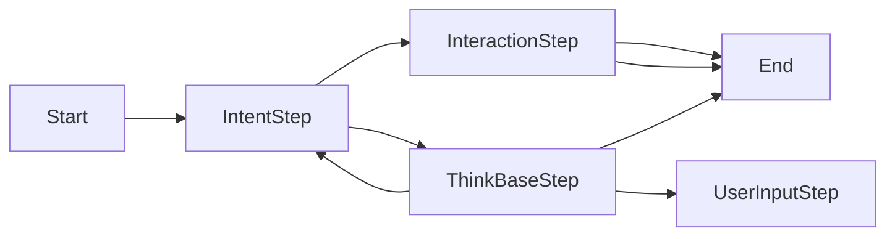

# ThinkBase.SemanticKernel.Process
Microsoft Semantic Kernel enables the development of Agentic AI.

In the semantic Kernel, Agentic AI  comes in two flavors: Agents and Processes.

While processes are less stable than the agent solution, they have the benefit of being more controllable: the processing and calling of agents is determined by a state machine, rather than a controlling agent.

## ThinkBase

[ThinkBase](https://thinkbase.ai) is a SaaS system that permits the creation of dynamic knowledge graphs. These are directed networks that contain fuzzy logic rule sets on the nodes that can determine the course of traversals accross the network and determine tha value of data items transferred.

ThinkBase knowledge graphs can be created by hand or by machine learning. They represent a way to encapsulate knowledge that is human-understandable, auditable and reproducible.

Using this code, you can add processing that is completely deterministic and transparent into a conversation with a user that can generate data items for further processing by LLMs.
Thus, you can build Agentic AI systems that will pass compliance requirements, such as the EU's AI act, without expensive and time consuming testing.

## This repository

This repository contains a semantic kernel process step, essentially a processing step that can be incorporated into many other processes, and a website demonstrating functionality.
To use this step you will need to have an account at [ThinkBase](https://thinkbase.ai) which is inexpensive for low volume users.

Interrogating a ThinkBase Knowledge graph involves selecting a target node - normally there is only one logical choice - and running the inference process on the network. This determines which data items are needed to satisfy the target node, and prioritises them according to their importance (salience) in satifying the node.
If the data items are not known, the inference engine will ask the user to fill them in, one at a time, and in order of salience. This creates a conversation with the user. As each data item is recieved, the inference process is repeated, and any data items made redundant by the answer are removd from the queue.

The ThinkBase process step encapsulates and interrogates a knowledge graph existing in the developer's account on the ThinkBase SaaS site.

The ThinkBase process code step defines a couple of events. One calling for more data, and the other reporting the process has completed. To integrate the ThinkBase Step into your processes, you need only call the step, and reroute all responses to that step until the exit event is generated.
The step uses ChatHistory to pass new requests to the user. The process pauses until data is returned. 

## Nuget package
The process step is available as a Nuget package.

```
dotnet add package AICompliance.ThinkBase.Process 
```

## The demo website

In order to demonstrate this, a demo website is included. This can be seen running at:[https://semanticdemo.thinkbase.ai](https://semanticdemo.thinkbase.ai)

This uses two other of our open source blazor components in order to create a chat interface. 

ThinkBase will often offer multiple choices when asking a question. These are represented in this demo as [AdaptiveCards](https://adaptivecards.io/), which are compatible with the Microsoft Bot Framework, and Microsoft Teams, etc.

Chat interfaces, like the Bot Framework, Teams chat, and the [Microsoft.Extensions.AI](https://github.com/dotnet/extensions/tree/main/src/Libraries/Microsoft.Extensions.AI) ChatClient have a call/response model. Semantic Kernel processes are oriented towards a pub/sub model, where the agent's reponse can be completely decoupled from the user request that caused it. This is necessary, because Semantic Kernel processes can be run in a distributed fashion. However, in this example we will use the local process runtime. 


This diagram shows how the demo is arranged. The IntentStep acts as a manager and determines if the users input is a request for the knowledge graph, or a general request. If the latter, the query is passed to the Interaction step which gets the selected LLM to respond, after which the process ends.
If the former, the knowledge graph step is called. The selected knowledge graph is interrogated via the ThinkBase GraphQL API, and a response is generated. These responses are objects, rather than plain text, and contain formatting and status information as well as the texual response.
The intentStep passes all subsequent responses on to the ThinkBaseStep until either a watchdog count of cycles is exceeded or the object returned from the ThinkBase API indicates the process is complete. Typically the last reponse of the Knowledge Graph is a response containing a report or one or more data values.

In this demo the ThinkBase Knowledge graph formatting and data types are used directly to create the user interface elements, such as lists of possible responses presented as button, text or links.  There is nothing to prevent the developer from using the returned json directly with an LLM, and we'll consider this for a later demo.
ThinkBase generates rich responses, including possibilistic certainty information with scores for each generated category for categorical outputs, tolerance values presented as fuzzy sets for numeric values, and rich text formatting for textual results based on Markdown., 


